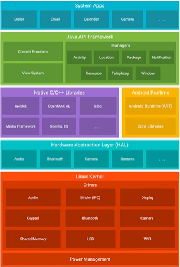

# 📱 Panorama Geral da Carreira Mobile

O desenvolvimento mobile se divide em duas grandes abordagens:

---

## 1. 🧩 Desenvolvimento Nativo

É quando você cria apps específicos para **cada sistema operacional**, utilizando a linguagem oficial e os recursos do próprio sistema.

### 📌 Plataformas:

- **Android**  
  - Linguagem: **Kotlin** (ou Java, mas Kotlin é o recomendado e oficial)
- **iOS**  
  - Linguagem: **Swift** (ou Objective-C, mas Swift é o moderno e recomendado)

✅ **Vantagens**:
- Melhor performance
- Acesso total aos recursos nativos (GPS, câmera, sensores, notificações, etc.)
- Melhor integração com as diretrizes de design de cada sistema

❌ **Desvantagens**:
- Dois códigos diferentes (Android e iOS)
- Mais tempo e custo para manter os dois apps

---

## 2. 🔁 Desenvolvimento Cross-Plataform (Multiplataforma)

Criação de **um único código** que é executado tanto no Android quanto no iOS.

### 📌 Tecnologias:

- **Flutter**
  - Linguagem: **Dart**
  - Desenvolvido pelo Google
- **React Native**
  - Linguagem: **JavaScript / TypeScript**
  - Desenvolvido pelo Facebook
- **Kotlin Multiplatform (KMP)**
  - Permite **compartilhar a lógica de negócio** (não a UI) entre Android e iOS
  - Linguagem: **Kotlin**

✅ **Vantagens**:
- Reutilização de boa parte do código
- Menor tempo de desenvolvimento
- Ideal para MVPs e startups

❌ **Desvantagens**:
- Reaproveitamento de código **não é 100%**
- Pode ter limitações em recursos muito nativos ou específicos de cada sistema
- Performance pode ser inferior a apps nativos em alguns casos

---

# 📱 Planejando Plano de Estudo em Android

---

## 1. Arquitetura do Android

No Android temos 5 camadas (blocos):

- Aplicação  
- Framework Android  
- Bibliotecas  
- Android Runtime  
- Kernel Linux  

**Foco de estudo:**  
- Se aprofundar em **Aplicação** e **Framework Android**  
- As demais camadas são acessadas indiretamente por meio do Framework

---

## 2. Linguagens de Programação

- **Kotlin** ou **Java** → para criação de aplicativos **nativos**
- **Flutter (Dart)** → para aplicativos **não nativos/multiplataforma**

> Ambas compilam para bytecode, interpretado pela Android Runtime (ART)

---

## 3. Ferramentas

### a) SDK - *Software Development Kit*

Para rodar um app em um dispositivo é necessário especificar a versão do SDK.

Itens presentes no SDK:

- Android SDK Build Tools  
- Android Emulator  
- Android SDK Platform Tools  
- Android SDK Tools  

### b) Android Studio (IDE)

- **Recomendado**, pois já instala o SDK e ferramentas necessárias.
- Pode-se usar **VSCode**, mas será necessário configurar tudo manualmente.
- Requisitos mínimos: **8GB de RAM**
- Baixe em: [develop.android.com](https://developer.android.com/)

---

## 4. Componentes do Android

Aplicativos Android são compostos por **componentes reutilizáveis**.  
Exemplo: `Activity` é iniciada quando o usuário clica no ícone do app.

### Tipos principais de componentes:

1. **Activities** – componentes com interface  
2. **Services** – tarefas em segundo plano, sem UI  
3. **Broadcast Receivers** – resposta a mensagens do sistema  
4. **Content Providers** – gerenciamento de dados compartilhados  

### Outros conceitos importantes:

- **WorkManager** – gerencia tarefas em background  
- **Intents** – mensagens que ativam componentes  
- **AndroidManifest.xml** – arquivo onde os componentes são registrados

---

## 5. Recursos do Aplicativo

São todos os elementos visuais e estáticos utilizados na aplicação.

Tipos de recursos:

- `anim/` – animações  
- `color/` – cores  
- `drawable/` – imagens e formas  
- `layout/` – arquivos XML de layout  
- `menu/` – menus do app  
- `values/` – strings, dimensões, estilos etc.

---

## 6. Ciclo de Vida de uma Activity

Durante sua vida útil, uma `Activity` passa por **vários estados**.

Cada transição dispara **callbacks**, como:

- `onCreate()`  
- `onStart()`  
- `onResume()`  
- `onPause()`  
- `onStop()`  
- `onDestroy()`  

📌 Exemplo:  
Ao clicar em uma notificação do WhatsApp, a activity atual é pausada ou destruída, dependendo do comportamento do sistema.

---

## 7. Componentes da Arquitetura Android

Conjunto de bibliotecas que ajudam a criar apps robustos, testáveis e com boa separação de responsabilidades.

Principais bibliotecas:

- **Lifecycle-aware components** – detectam mudanças de estado do app
- **LiveData** – lida com dados observáveis em tempo real
- **Room** – biblioteca para mapeamento de banco de dados SQLite

---

## 8. Arquitetura do Aplicativo

Padrões comuns de arquitetura:

- **MVVM (Model - View - ViewModel)** – recomendado
- **ViewModel** – separa a lógica de negócio da UI
- **Room** – mapeamento objeto-relacional com SQLite

---
